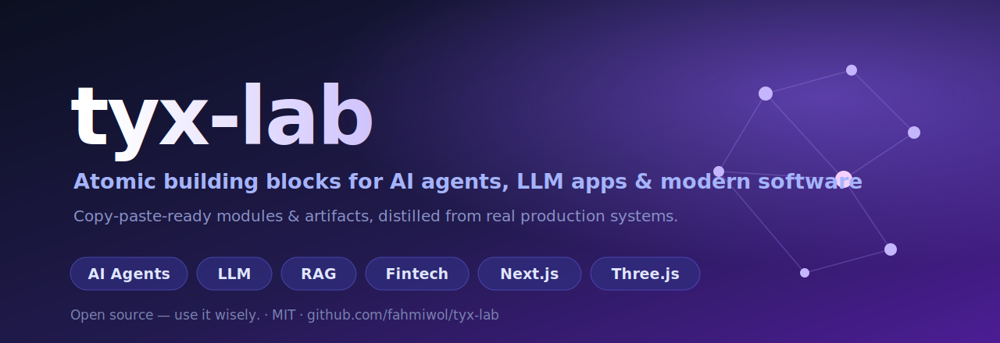

<h1 align="center">tyx-lab</h1>
<h3 align="center">Atomic Building Blocks &amp; Mini-Tools for AI Agents, LLM Apps, RAG &amp; Modern Software</h3>

188 ready-to-use <b>modules</b>, <b>artifacts</b> &amp; runnable <b>tools</b> &mdash; LLM routing, RAG, agent loops, MCP servers, prompt engineering, fintech ledgers &amp; minting, Next.js SaaS, Three.js &mdash; each distilled from a <b>real, running production system</b>. Copy a piece, or run a whole mini-app. No framework attached.
 <b>Open source &mdash; use it wisely.</b>

<a href="tools/"><b>Tools</b></a> &middot; <a href="modules/"><b>Modules</b></a> &middot; <a href="artifacts/"><b>Artifacts</b></a> &middot; <a href="recipes/"><b>Recipes</b></a> &middot; <a href="index.json"><b>index.json</b></a> &middot; <a href="CONTRIBUTING.md"><b>Contribute</b></a>

---

## What is this?

Every atom here was pulled out of a real system and stripped to its **smallest reusable unit**. Each does exactly one thing, so you can lift it into a completely different project. Three ways to use it:

- **`tools/`** &mdash; **runnable** mini-tools & mini-apps: single-file web apps, CLIs, **MCP servers**, scripts. Just run it. (`tool.json` + `src/` + `README.md`)
- **`modules/`** &mdash; atomic **code** you import: one job, one file. (`module.json` + `src/` + `README.md`)
- **`artifacts/`** &mdash; atomic **non-code**: prompts, templates, formulas, methods, playbooks, frameworks, checklists, findings. (`ARTIFACT.md` + `artifact.json`)
- **`recipes/`** &mdash; how to stitch several atoms into a working use case.

## Who is this for?

Anyone building **AI agents, agentic AI, LLM apps, RAG pipelines, MCP servers, AI tools, self-hosted models, SaaS, or software** who would rather grab a battle-tested piece than reinvent it.

---

## Catalog &mdash; 188 atoms

> `21` tools &middot; `98` modules &middot; `69` artifacts. Machine-readable: [`index.json`](index.json).

### Tools &mdash; runnable mini-apps, CLIs & MCP servers (21)

<b>AI, Agents & LLM</b> (4)

- **[Agentic Framework](tools/agentic-framework)** &mdash; `script` &mdash; Lightweight framework for building autonomous agents with tool use, planning, and memory. Supports multiple LLM backends, extensible tool regi...
- **[AI Prompt Lab](tools/ai-prompt-lab)** &mdash; `web-app` &mdash; Craft, test, and refine AI prompts. Write positive/negative prompts, choose models and styles, generate images. Save and manage prompts.
- **[Background Remover](tools/bg-remover)** &mdash; `web-app` &mdash; Remove image backgrounds with AI-powered processing. Upload photos and download PNG with transparent background.
- **[TTS Voice Module](tools/tts-module)** &mdash; `script` &mdash; Multi-engine Text-to-Speech module with voice cloning support. Supports OpenAI TTS, Coqui XTTS-v2 (self-hosted), and Web Speech API. React com...

<b>Infrastructure & Backend</b> (4)

- **[CLI Tool Template](tools/cli-tool-starter)** &mdash; `cli` &mdash; Minimal command-line interface template with argument parsing, config storage, and example commands. Adapt for any domain.
- **[MCP Server Skeleton](tools/mcp-server-starter)** &mdash; `mcp-server` &mdash; Minimal stdio-transport MCP server template with tool registration & example tool. Use as foundation for adapting any service/API to MCP.
- **[Platform Connector Adapter](tools/connector-adapter)** &mdash; `script` &mdash; Unified API connector layer for social/commerce platforms. Adapters for messaging APIs, analytics feeds, e-commerce integrations. Configurable...
- **[Visual Flow Builder](tools/visual-flow-builder)** &mdash; `web-app` &mdash; Browser-based visual flow builder for composing multi-step workflows. Drag-and-drop steps, configure parameters, save as JSON, and execute flows.

<b>Business, SaaS & Fintech</b> (3)

- **[Content Calendar](tools/content-calendar)** &mdash; `web-app` &mdash; Editorial calendar for content planning and scheduling. Month/week/day views, drag-drop scheduling, status tracking, team collaboration.
- **[Credit & Usage Dashboard](tools/usage-dashboard)** &mdash; `web-app` &mdash; Real-time credit balance and usage tracking dashboard. Polls backend for credit status, displays 30-day trends with mock data fallback, cost v...
- **[Embeddable Balance Widget SDK](tools/embeddable-balance-widget-sdk)** &mdash; `tool` &mdash; JavaScript/React SDK for embedding real-time wallet balance display in partner web apps. Reads from public REST API, handles currency formatti...

<b>Ops & Methodology</b> (3)

- **[Log Viewer Dashboard](tools/log-viewer)** &mdash; `web-app` &mdash; Real-time reactive log viewer with polling & Socket.io support. Displays structured logs with live refresh, filtering by agent/service, and st...
- **[Upload Monitor Dashboard](tools/upload-monitor)** &mdash; `web-app` &mdash; Real-time file upload monitoring dashboard. Tracks upload progress, file sizes, error rates, queue status with live updates via Socket.io.
- **[World Config Editor](tools/world-editor)** &mdash; `web-app` &mdash; Monaco-based JSON editor for world.json configuration files. Direct load/save from gateway backend with syntax highlighting and validation.

<b>Video, Media & Publishing</b> (2)

- **[Image to Video](tools/image-to-video)** &mdash; `web-app` &mdash; Animate static images into videos with AI. Add motion prompts, choose from cinematic/anime/3D styles, set duration and FPS, download MP4.
- **[Video Editor](tools/video-editor)** &mdash; `web-app` &mdash; Edit videos with trim, text overlay, and audio controls. Multi-track timeline with visual editing. Import, edit, preview, and export videos.

<b>3D, Graphics & Games</b> (2)

- **[Canvas Editor (Fabric.js)](tools/canvas-editor)** &mdash; `web-app` &mdash; 2D canvas editor powered by Fabric.js v6. Full-featured drawing, object manipulation, export/import with REST API backend (Express).
- **[Image to 3D](tools/image-to-3d)** &mdash; `web-app` &mdash; Convert 2D images to interactive 3D models. Upload photos with optional prompts, choose output format (GLB/OBJ/FBX), and preview in real-time ...

<b>Games</b> (1)

- **[NPC Generator](tools/npc-generator)** &mdash; `web-app` &mdash; Generate game characters with customizable stats, rarity levels, and roles. Browse roster, export character data, integrate with game worlds.

<b>Design</b> (2)

- **[Map Generator](tools/map-generator)** &mdash; `web-app` &mdash; Generate procedural maps from descriptions. Choose size/style (cyberpunk/nature/scifi/fantasy), preview with tile-based rendering, export JSON.
- **[Photo Editor](tools/photo-editor)** &mdash; `web-app` &mdash; Edit photos with 12+ filter presets, brightness/contrast/saturation controls, and sticker overlays.

### Modules &mdash; atomic code (98)

<b>AI, Agents & LLM</b> (19)

- **[Agent Memory: 3-Layer Progressive Retrieval](modules/agent-memory-3layer-retrieval)** &mdash; Memory architecture for agents: index layer (FTS5), timeline layer (recent events), full context layer. Reduces token use 10x via progressive ...
- **[Agent Persona Registry](modules/agent-persona-registry)** &mdash; Unified schema for registering NPC identities, personalities, skills, and role mappings in multi-agent systems.
- **[AI Asset Quality Gate](modules/ai-asset-quality-gate)** &mdash; Automated quality checks for AI-generated content (title/keyword/disclosure validation + scoring)
- **[AI Metadata Stock Generator](modules/ai-metadata-stock-generator)** &mdash; Generate title, keywords, description, and AI disclosure for stock marketplace assets
- **[AI Provider Router with Fallback](modules/ai-provider-router-fallback)** &mdash; Route LLM calls across multiple OpenAI-compatible endpoints with automatic fallback chaining.
- **[Behavior Tree & FSM State Model](modules/behavior-tree-fsm-state-model)** &mdash; Declarative schema for agent behavior: finite state machine (FSM) with states, transitions, conditions, and actions. Serializable and composable.
- **[Brand Schema Validator](modules/brand-schema-validator)** &mdash; Zod-based schema for 5-step brand brief intake: positioning, competitive analysis, tone, archetype, cultural context. Validates form input, LL...
- **[Dialogue Tree: Branching Narrative Model](modules/dialogue-tree-branching-narrative)** &mdash; Declarative dialogue tree for NPC conversations: branches, conditions, player choices, dialogue outcomes. Serializable for save/load and branc...
- **[Jungian Archetype Selector](modules/jungian-archetype-selector)** &mdash; Canonical 12 Jungian brand archetypes mapped to quadrants with voice markers, core desires, and brand examples — for strategic positioning a...
- **[LLM Provider Registry Switchable](modules/llm-provider-registry-switchable)** &mdash; Declarative multi-provider LLM registry with fallback support (OpenRouter, HF, OpenAI, Anthropic, Gemini, custom)
- **[Multi-Provider AI Router](modules/ai-router)** &mdash; Unified LLM client with auto-fallback: Gemini→Cerebras→OpenAI→Anthropic→Pollinations. Prioritizes BYOK.
- **[Multi-Provider AI Router](modules/ai-router-fallback)** &mdash; Fallback AI content provider with priority: Groq (free) → Gemini (free) → Ollama (local) → Anthropic. Handles timeouts, fallback, and un...
- **[Self-Refining Agent Loop (Tafakkur Pattern)](modules/agent-self-refine-loop)** &mdash; Dual-agent criticism loop: innovator generates → critic evaluates across multiple modes → refine or accept. Prevents single-pass mediocrit...
- **[Server-Sent Event Chat Stream Parser](modules/sse-chat-stream-parser)** &mdash; Parse SSE frames from LLM/chat streaming endpoints. Tolerant of multiple JSON payload formats (token/delta/content/text variants), plain text ...
- **[Skill Registry Contract Pattern](modules/skill-registry-contract)** &mdash; Contract-enforced skill registry with boot-time validation: description and parameters mandatory, tools self-documenting.
- **[Telegram Command Router & Inline Keyboard Builder](modules/telegram-command-router)** &mdash; Route Telegram bot commands to handlers and build inline keyboard UI with callback actions.
- **[Tile Grid Coordinator](modules/tile-grid-coordinator)** &mdash; Pure grid coordinate conversion utility for top-down and isometric tile maps (RPG/Gather-style). Square tiles, screen offset support, Manhatta...
- **[Tools Catalogue Schema](modules/tools-catalogue-schema)** &mdash; Unified registry schema for media providers, LLM vendors, and callable tools with free/paid status, fallback chains, and compatibility.
- **[TTS Provider Wrapper](modules/tts-provider-wrapper)** &mdash; Abstraction layer for TTS services (OpenAI, Google Cloud, Azure) with caching, rate limiting, and streaming output. Normalizes provider APIs i...

<b>Infrastructure & Backend</b> (31)

- **[AES-256-GCM Secret Encrypt/Decrypt](modules/aes-256-gcm-secret)** &mdash; Encrypt/decrypt sensitive data (API keys, tokens, secrets) with AES-256-GCM. Output: base64(iv || authTag || ciphertext). Key derived from env...
- **[Atomic JSON File Store](modules/json-store-persistence)** &mdash; Concurrency-safe file-based JSON storage with atomic write (temp+rename), read, and update.
- **[Audio Chunk Streamer](modules/audio-chunk-streamer)** &mdash; HTTP streaming for large audio files with chunked transfer encoding. Supports range requests, pause/resume, and adaptive bitrate.
- **[Auth Session Token Manager](modules/auth-session-token-manager)** &mdash; In-memory session + token auth with bcrypt hashing and Express middleware
- **[B2B API-Key Gateway Pattern](modules/b2b-api-key-gateway-pattern)** &mdash; Multi-tier API key management for platform partners. Supports key rotation, rate limiting per API key, transaction signing with shared secrets...
- **[Browser Automation Engine](modules/browser-automation-engine)** &mdash; Anti-detection browser launcher (patchright > playwright-extra > playwright). Supports Browserbase/Steel cloud.
- **[BullMQ Job Enqueuer](modules/bullmq-job-enqueuer)** &mdash; Wrapper for BullMQ queue with exponential backoff, retry policy, and auto-cleanup. Standardizes job enqueueing for e-commerce workflows (scrap...
- **[Dual-Auth Internal Key Pattern](modules/dual-auth-internal-key-pattern)** &mdash; Server-to-server + user authentication hybrid: (1) Client sends JWT (user auth), (2) Server adds x-internal-key header (server auth). Prevents...
- **[Environment Config Schema](modules/env-config-schema)** &mdash; Pydantic-based environment variable configuration with type coercion, validation, and defaults. Single source of truth for app settings across...
- **[Exchange Rate Oracle Updater](modules/exchange-rate-oracle-updater)** &mdash; Trusted price feed mechanism that updates denomination-to-fiat conversion rates via authenticated oracle transactions. Supports historical rat...
- **[Exponential Backoff Queue](modules/exponential-backoff-queue)** &mdash; BullMQ queue configuration with exponential backoff retry strategy. Prevents thundering herd, includes auto-cleanup, and supports preset strat...
- **[Human-Like Timing Utilities](modules/human-timing-utils)** &mdash; Sleep/delay helpers: typing speed, page reads, request gaps. For realistic bot behavior & rate-limit avoidance.
- **[JSON File Store — Atomic](modules/json-file-store-atomic)** &mdash; Atomic ACID-like JSON file-based storage with read/write/update and recovery
- **[JWT Auth Cookies](modules/jwt-auth-cookies)** &mdash; JWT-based authentication with secure httpOnly cookies, refresh token rotation, and access token expiry. Handles auth state across SPA + API.
- **[JWT Token Helper](modules/jwt-token-helper)** &mdash; Create and validate JWT access tokens with configurable TTL. Handles token generation, validation, claim extraction, and error cases for FastA...
- **[Media Provider Fallback Orchestrator](modules/media-provider-fallback-orchestrator)** &mdash; Orchestrate calls to media providers (image, video, audio, design) with automatic fallback on failure and cost/quota tracking.
- **[Meta Webhook Verifier](modules/webhook-meta-verify)** &mdash; Verify Meta Cloud API webhook challenge-response and HMAC-SHA256 signatures. Validates webhook authenticity and prevents spoofing for WhatsApp...
- **[Password Hashing with Scrypt](modules/password-scrypt-hash)** &mdash; Hash and verify passwords using scrypt (Node built-in crypto). Format: hexSalt:hexKey. No native dependencies. Timing-safe comparison.
- **[Prisma Lifecycle Service](modules/prisma-lifecycle-service)** &mdash; NestJS injectable Prisma service with automatic connection management. Implements OnModuleInit/OnModuleDestroy for graceful startup and shutdo...
- **[Rate-Limited Message Queue Scheduler](modules/message-queue-scheduler)** &mdash; Batching queue with per-destination throttling and retry for scheduled/bulk dispatch.
- **[Redis Queue Wrapper](modules/redis-queue-wrapper)** &mdash; Factory pattern for Redis connection pooling and RQ queue management. Provides singleton Redis connection and named queues for reliable task e...
- **[Relative Timestamp Formatter](modules/relative-timestamp-formatter)** &mdash; Format dates as human-readable relative timestamps (5m ago, 2h ago) and locale-aware time strings. Zero dependencies; works in browsers and Node.
- **[Rotating User-Agent Pool](modules/rotating-useragents)** &mdash; Real browser UAs (2026 updated), weighted by market share. Chrome 65%, mobile 15%, Firefox 5%, Safari 10%, Edge 5%.
- **[Safe localStorage Wrapper](modules/safe-localstorage-wrapper)** &mdash; Browser localStorage with graceful fallback on quota exceeded or unavailability. JSON serialization, prefixed keys, silent error handling, ret...
- **[Server Auth Token Cache](modules/server-auth-token-cache)** &mdash; Self-healing JWT token cache for backend services. Auto-refresh when expiry approaches (60s buffer). Graceful fallback to static token. Extrac...
- **[Stealth Fetch Engine](modules/stealth-fetch-engine)** &mdash; curl-based HTTP client with anti-detection via TLS fingerprinting bypass, rotating UA, Chrome headers. Evades WAF blocks.
- **[Token Burn & Redemption Audit Trail](modules/token-burn-redemption-audit)** &mdash; Immutable ledger of token burn events with cryptographic commitment. Records burn reason, timestamp, authorizer, and withdrawal destination. E...
- **[Token Supply Cap & Reserve Accounting](modules/token-supply-cap-accounting)** &mdash; Tracks minted, burned, and circulating supply across denominations with hard limits per tier. Computes remaining mintable reserve and validate...
- **[Webhook Dispatcher](modules/webhook-dispatcher)** &mdash; Fan-out webhook dispatcher for multiple integrations with configurable timeout and error handling. Posts events to active endpoints, logs resp...
- **[Webhook Meta Header Validator](modules/webhook-meta-header-validator)** &mdash; Validate Meta (WhatsApp/Facebook/Instagram) webhook signature using HMAC-SHA256. Prevents replay/spoofing attacks.
- **[WhatsApp Multi-Device Session Connector](modules/wa-session-baileys-connector)** &mdash; Manage WhatsApp multi-device sessions with per-tenant isolation, QR auth, and auto-reconnect.

<b>Business, SaaS & Fintech</b> (23)

- **[Admin Approval Workflow — Maker-Checker Pattern](modules/admin-approval-maker-checker)** &mdash; Four-eye approval system for high-value or sensitive operations (withdrawals, rate changes, supply adjustments). Separates initiation (Maker) ...
- **[Append-Only Audit Log](modules/audit-log-pattern)** &mdash; Immutable append-only audit trail for fintech/compliance. Dual-track user + admin logs with soft-fail, denormalization, and request metadata c...
- **[Command Intent Router](modules/command-intent-router)** &mdash; Parse text commands and route to intent handlers. Supports regex patterns, fuzzy matching, and parameter extraction.
- **[Currency Formatter & Conversion](modules/currency-formatter)** &mdash; Format and convert between IDR and USD. Rate stored in DB or env, with fallback. Display helpers for prices with/without conversions.
- **[Denomination Unit Price Resolver](modules/denomination-unit-price-resolver)** &mdash; Lookup table: Denomination → IDR unit price. Resolves GOLD, SILVER, BRONZE, DIAMOND to fiat value. Supports versioned snapshots for historic...
- **[Design Tokens Generator](modules/design-tokens-generator)** &mdash; Complete design token system (colors, typography, spacing, radius, shadow) — compiles to CSS custom properties and Tailwind preset.
- **[Double-Entry Ledger](modules/double-entry-ledger)** &mdash; Immutable transaction ledger for fintech: P2P transfers, conversions with fees, mint/reward/withdraw operations. Includes denormalized balance...
- **[Email Template Builder](modules/email-template-builder)** &mdash; Compile email templates with safe variable substitution and reusable partials.
- **[Idempotent Payment Processing](modules/idempotent-payment-processing)** &mdash; Prevent duplicate transactions from webhook retries using deterministic idempotency keys. Guards against double-crediting users.
- **[Intent Pattern Matcher](modules/intent-pattern-matcher)** &mdash; Static rule-based intent classifier for domain language (Indonesian commerce: stock check, production logging, sales). Avoids LLM calls by pat...
- **[Message Pipeline Router](modules/message-pipeline-router)** &mdash; Inbound webhook message handler with intent parsing and action dispatch. Normalizes multi-channel input (WhatsApp, Telegram) → parses intent...
- **[Minimal Session Cookie Auth](modules/minimal-session-cookie)** &mdash; HMAC-SHA256 signed session tokens (no external auth library). Payload: base64(json).signature. Stores in httpOnly cookie with 14-day TTL.
- **[Multi-Denomination Wallet Balance](modules/multi-denom-wallet-balance)** &mdash; Track wallet balances across 4+ currency types (GOLD/SILVER/BRONZE/DIAMOND) with real-time fiat conversion. Returns normalized balance object:...
- **[Nodemailer Email Template](modules/nodemailer-email-template)** &mdash; Email dispatch via nodemailer with SMTP relay. Graceful fallback if SMTP unconfigured. Built-in HTML templates for common SaaS flows (purchase...
- **[Phone Normalization](modules/phone-normalization)** &mdash; Normalize and validate phone numbers for Southeast Asia (Indonesia 62). Handles leading zeros, country codes, and formats for WhatsApp/messagi...
- **[Social Post Auto-Scheduler](modules/social-post-scheduler)** &mdash; Background worker (60s interval) that publishes scheduled social posts when scheduled_at <= now(). Supports batch processing, transactional up...
- **[Statement & Receipt Generator](modules/statement-receipt-generator)** &mdash; On-demand PDF generation of transaction statements and receipts. Supports date range filtering, denomination breakdown, QR code embedding for ...
- **[Tiered Quota & Rate-Limit Resolver](modules/tiered-quota-resolver)** &mdash; Check daily usage quota across tiers (admin/pro/free/anon). Supports IP-based hashing for anonymous users, cookie-based auth (admin/user token...
- **[Transfer Intent Checkout State](modules/transfer-intent-checkout-state)** &mdash; Embeddable payment checkout lifecycle: (1) Client creates intent via public API key, (2) Proxy forwards to bank with internal key (CORS-safe),...
- **[Trigger-Based Reward Schedule](modules/trigger-reward-schedule)** &mdash; Maps activity triggers (VIDEO_WATCH, QUIZ_COMPLETE, MISSION, etc.) → default reward amounts. Each trigger row: { trigger, label, defaultAmou...
- **[Wallet Denomination Ledger](modules/wallet-denomination-ledger)** &mdash; Append-only transaction log per wallet, per denomination. Tracks all movements: TRANSFER in/out, MINT received, BURN removed, HOLD reserved, S...
- **[Workflow DAG Executor](modules/workflow-dag-executor)** &mdash; Validate a workflow DAG (node integrity, cycle detection) and simulate/execute nodes in dependency order.
- **[Workflow Node Registry Builder](modules/workflow-node-registry-builder)** &mdash; Extensible registry of workflow node types with ports, executors, and UI metadata.

<b>Ops & Methodology</b> (8)

- **[Brute Force Login Guard](modules/brute-force-login-guard)** &mdash; Rate limiter for login attempts using IP+identifier tracking. Prevents credential stuffing with configurable window (15min default).
- **[CSRF Security Guard](modules/csrf-security-guard)** &mdash; CSRF token generation, validation, and session security hardening with HttpOnly + Secure + SameSite cookies.
- **[Database Sequential Number Generator](modules/db-numseq-generator)** &mdash; Generate sequential document/invoice numbers with prefix, period (YYYYMM), and auto-increment. Useful for invoices, orders, leads.
- **[Deploy Helper Scripts](modules/deploy-helpers)** &mdash; Reusable bash for Node.js SaaS: NVM detection, git pull, npm install, build, PM2 restart. Timestamped logging.
- **[Multi-Channel Alert Notifier](modules/notifier)** &mdash; Alert dispatch via WhatsApp, email, logs with throttling (1/hour per source+provider+level).
- **[Pagination Helper](modules/pagination-helper)** &mdash; Compute pagination windows (page, total, offset, page links) for lists and APIs.
- **[Provider Quota Tracker](modules/quota-tracker)** &mdash; Admin-only quota tracking for shared providers (HF, RunPod, OpenAI). Daily/monthly caps, alerts at 70%/90%/100%.
- **[Rupiah Currency & Text Formatter](modules/rupiah-formatter)** &mdash; Format numbers as IDR currency with short notation (M/jt/rb), and convert to Indonesian words (terbilang).

<b>CRM & Pipeline</b> (1)

- **[Sales Pipeline Stage Machine](modules/sale-pipeline-stages)** &mdash; Sales pipeline stage machine with SLA tracking and terminal state detection.

<b>Video, Media & Publishing</b> (5)

- **[Infinite Feed Renderer](modules/infinite-feed-renderer)** &mdash; Vertical infinite scroll feed container with post list and navigation. Decoupled from data source; compose with your own post component.
- **[Ken Burns FFmpeg Renderer](modules/ken-burns-ffmpeg-renderer)** &mdash; Command-line video generation from still images using Ken Burns zoom-pan effect. Chains ffmpeg with zoompan filter for cinematic image→video...
- **[Multi-Platform Publisher Adapter](modules/multi-platform-publisher-adapter)** &mdash; One interface to publish/assist-publish a video to YouTube, TikTok, Instagram, and Facebook.
- **[Story Carousel Component](modules/story-carousel-component)** &mdash; Instagram-style story carousel using compound component pattern. Horizontal scroll with narrative-driven UX. Styled, responsive.
- **[YouTube Resumable Upload Wrapper](modules/youtube-upload-wrapper)** &mdash; Wrap the YouTube Data API for OAuth + resumable uploads with processing/transcript polling.

<b>3D, Graphics & Games</b> (10)

- **[A* Tilemap Pathfinder](modules/astar-tilemap-pathfinder)** &mdash; Classic A* pathfinding algorithm for orthogonal tile grids. Supports 4 or 8-direction movement, configurable heuristics (Manhattan/Euclidean),...
- **[Day Night Cycle](modules/day-night-cycle)** &mdash; 24-hour environment cycle for Three.js scenes. Interpolates directional light, ambient light, fog, and clear color through keyframe-defined ph...
- **[Game Loop with Fixed Timestep](modules/game-loop-fixed-timestep)** &mdash; requestAnimationFrame game loop with decoupled fixed-rate update (physics/logic) and variable-rate render. Includes frame skip limits, FPS tra...
- **[Image with Fallback Component](modules/image-with-fallback)** &mdash; React component for images with inline fallback SVG on load error. Preserves dims and className. Useful for user-generated content, avatars, p...
- **[NPC World State Model](modules/npc-world-state-model)** &mdash; Declarative JSON schema for representing a room/world state: grid, objects, agents, zones, floors, themes.
- **[Orthographic Camera Rig](modules/orthographic-camera-rig)** &mdash; Three.js orthographic camera controller with smooth follow, drag-to-pan, mouse wheel zoom, and touch pinch-zoom. Ideal for top-down/isometric ...
- **[Raycaster Object Picker](modules/raycaster-object-picker)** &mdash; Three.js mouse/touch-to-3D object picking via raycasting. Click/tap to select objects, optional hover highlighting with customizable color. Ev...
- **[Sprite Sheet Animator](modules/sprite-sheet-animator)** &mdash; Canvas 2D sprite sheet animation player. Manages frame sequences, playback speed, looping, ping-pong, and draw positioning. Ideal for characte...
- **[Three.js Scene Bootstrap](modules/three-scene-bootstrap)** &mdash; Minimal WebGL scene initialization with renderer, scene, configurable lights, fog, and resize handling. Factory pattern for lights (ambient/di...
- **[World Renderer Three.js Bootstrap](modules/world-renderer-three-bootstrap)** &mdash; Three.js initialization: camera, lights, environment, post-processing, and render loop for isometric world rendering.

<b>Research & AI Training</b> (1)

- **[Knowledge Graph from Wikilinks](modules/knowledge-graph-wikilinks)** &mdash; Pure TypeScript module to extract and build directed graphs from markdown notes using [[wikilink]] syntax. Backlink indexing, graph visualizat...

### Artifacts &mdash; atomic non-code (69)

<b>AI, Agents & LLM</b> (24)

- **[Agent Persona Router](artifacts/agent-persona-router)** &mdash; `method` &mdash; Dispatch tasks to specialized agent personas with isolated memory.
- **[Asbabun Nuzul: Grounded Brief Pattern](artifacts/asbabun-nuzul-grounded-brief)** &mdash; `playbook` &mdash; Every creative output grounded in specific trigger (Asbabun Nuzul). Extract: trigger event, specific audience, concrete moment, real tension. ...
- **[Autonomous Growth Flywheel](artifacts/autonomous-growth-flywheel)** &mdash; `framework` &mdash; Closed-loop architecture for autonomous AI systems: input→process→store→output layers enabling self-improvement without manual training
- **[Autonomy System Pre-Flight Checklist](artifacts/autonomy-preflight-checklist)** &mdash; `checklist` &mdash; Critical reconnaissance checklist before executing tasks in autonomous AI systems to avoid context loss and server/repo confusion.
- **[Brief to Storyboard to Video Pipeline](artifacts/brief-to-video-storyboard-pipeline)** &mdash; `playbook` &mdash; End-to-end methodology for generating short-form video content (20-30 sec) from a brief, featuring Visual DNA consistency, AI storyboard gener...
- **[Continuous Learning & Self-Evolution: System-Centric Learning Without Catastrophic Forgetting](artifacts/continuous-learning-evolution-methodology)** &mdash; `method` &mdash; Methodology for enabling AI agents to continuously improve through experience without retraining base model, based on Stability-Plasticity Tra...
- **[Continuous Learning via Reflective Loop (Tafakkur)](artifacts/continuous-learning-tafakkur)** &mdash; `framework` &mdash; Self-evolution without catastrophic forgetting: frozen core + dynamic LoRA adapters + episodic memory (error traces) + semantic memory (learne...
- **[Creative Brief Intake Framework (IHOS-Aligned)](artifacts/brief-intake-framework)** &mdash; `template` &mdash; Structured intake for creative briefs: capture all 4 semantic layers (Zahir/Batin/Hadd/Mathla), user state (Haal), grounding context (Asbabun ...
- **[Embedding / RAG Chunking](artifacts/embedding-rag-chunking)** &mdash; `method` &mdash; Split documents semantically for RAG with hierarchical metadata.
- **[Eval-Gate & Regression-Guard: Model Quality Certification Framework](artifacts/eval-gate-regression-guard)** &mdash; `framework` &mdash; Automated quality assurance system for SLMs that certifies new models are better than baseline before deployment, preventing regressions via M...
- **[IHOS Epistemology Framework](artifacts/ihos-epistemology-framework)** &mdash; `framework` &mdash; Islamic Epistemology (Ilmu Jariyah, Hifdz, Akses Umat, Sistem) as applied to AI system design. Translates 1400-year-old validation principles ...
- **[LLM Provider Fallback Router](artifacts/llm-provider-fallback)** &mdash; `method` &mdash; Route LLM calls across multiple providers with automatic fallback on error or rate limit.
- **[LoRA Continual Learning Without Catastrophic Forgetting](artifacts/lora-continual-learning)** &mdash; `method` &mdash; Methodology for incrementally improving SLMs via LoRA adapters while preserving previously learned knowledge, persona, and safety constraints.
- **[Multi-Provider Token & Cost Estimator](artifacts/token-cost-estimator)** &mdash; `method` &mdash; Estimate token counts and cost across LLM providers with caching.
- **[NPC Agent Identity & World-Object Schema: Gaming AI & Interactive Worlds](artifacts/npc-identity-world-schema)** &mdash; `schema` &mdash; Unified data model for defining NPC identities, world state, and relationships. Supports emergent gameplay where NPCs react based on persisten...
- **[Prompt Chain Orchestration](artifacts/prompt-chain-orchestration)** &mdash; `method` &mdash; Compose multi-step LLM workflows with loops and conditionals.
- **[Prompt Version Tracking](artifacts/prompt-version-tracking)** &mdash; `method` &mdash; System prompt versioning pattern — tag each LLM generation with prompt revision for A/B testing output quality.
- **[ReAct Agent Loop (Reason + Act + Observe)](artifacts/react-agent-loop-pattern)** &mdash; `playbook` &mdash; Reasoning + Action + Observation loop. Agent generates Thought → Action (tool call) → Observation (result) → loops until sufficient info...
- **[Reputation & Trust Scoring: Multi-Signal Agent Credibility Framework](artifacts/reputation-trust-scoring)** &mdash; `framework` &mdash; Framework for scoring agent trustworthiness based on multi-dimensional signals (completion rate, quality, fraud likelihood, financial health) ...
- **[SLM Distillation Pipeline: Teacher-Student Recursive Refinement](artifacts/slm-distillation-pipeline)** &mdash; `method` &mdash; Production-grade methodology for distilling knowledge from larger teachers into smaller SLMs via multi-teacher consensus voting and preference...
- **[SLM Identity Training Guide](artifacts/slm-identity-training-guide)** &mdash; `guide` &mdash; End-to-end guide for training small language model identity and behavior via SFT and DPO with contamination prevention and eval gates
- **[Slm Training Pipeline Patterns](artifacts/slm-training-pipeline-patterns)** &mdash; `method` &mdash; End-to-end SLM fine-tuning patterns including data curation, LoRA configuration, eval gates, and rollback procedures
- **[Visual Workflow Node Schema](artifacts/workflow-node-schema)** &mdash; `framework` &mdash; A visual-orchestration node contract and execution engine for chaining tools and LLMs.
- **[Voice Clone & TTS Playbook](artifacts/voice-clone-tts-playbook)** &mdash; `playbook` &mdash; End-to-end text-to-speech pipeline: user auth, voice synthesis, caching, credit system, marketplace listing. Reference implementation.

<b>Infrastructure & Backend</b> (17)

- **[Cost-Aware GPU Training Optimization](artifacts/cost-aware-gpu-training-optimization)** &mdash; `method` &mdash; Methods for reducing cloud GPU training costs through dependency caching, hardware selection, and pre-built images
- **[Credit Metering System: Real-Time Usage Tracking & Enforcement](artifacts/credit-metering-system)** &mdash; `framework` &mdash; Production system for tracking agent/user service consumption in real-time, enforcing quotas, and preventing over-spend in multi-tenant SaaS a...
- **[ERD & Data Model Design Method](artifacts/erd-data-model-design)** &mdash; `method` &mdash; Structured methodology for designing Entity-Relationship Diagrams and data models for multi-user platforms, covering entity inventory, relatio...
- **[exFAT Windows Fix for Next.js / Webpack](artifacts/exfat-windows-fix)** &mdash; `finding` &mdash; Fix EISDIR readlink crashes when building Next.js/Webpack projects on a Windows exFAT drive by shimming fs.readlink before webpack captures it.
- **[Frontend Deploy Bash Pattern](artifacts/frontend-deploy-bash-pattern)** &mdash; `template` &mdash; Parameterized shell script for zero-downtime frontend deployment: git pull, npm build, PM2 restart, rsync sync, health check verification.
- **[Git Workflow — Windows + Private GitHub Repo](artifacts/git-workflow-windows)** &mdash; `playbook` &mdash; Lean git setup and recovery flow tuned for Windows + a private GitHub repo: PAT auth, conventional commits, Windows path pitfalls, and safe undo.
- **[How to Build an MCP Server](artifacts/build-mcp-server)** &mdash; `methodology` &mdash; Step-by-step guide to authoring a Model Context Protocol server from scratch. Covers architecture, tool definition, registration, testing, dep...
- **[Idempotent Payment Retry Pattern](artifacts/idempotent-payment-retry-pattern)** &mdash; `artifact` &mdash; Reference design for payment retry logic that prevents duplicate charges. Uses idempotency keys (UUID-based), response caching, and state mach...
- **[Infrastructure Context Mapping](artifacts/infrastructure-context-mapping)** &mdash; `playbook` &mdash; Method for mapping multi-server, multi-repo projects to prevent execution confusion and ensure correct deployments
- **[LLM JSON Repair & Fallback](artifacts/json-repair-fallback)** &mdash; `method` &mdash; Recover valid JSON from malformed LLM output via repair and partial extraction.
- **[Meta Pixel + Conversions API with Dedup](artifacts/meta-capi-dedup)** &mdash; `playbook` &mdash; Wire Meta Pixel + server-side Conversions API with browser<->server event_id dedup for high Event Match Quality, no CAPI Gateway needed.
- **[Next.js + Three.js Deploy & WebGL Debugging Gotchas](artifacts/nextjs-webgl-deploy-gotchas)** &mdash; `finding` &mdash; Reusable failure modes when deploying a Next.js app with a Three.js/WebGL scene: stale-serve traps and silent GLB/meshopt render failures, wit...
- **[Next.js Subdomain Multi-Tenant Routing](artifacts/nextjs-subdomain-multitenant)** &mdash; `playbook` &mdash; Subdomain -> tenant rewriting in Next.js App Router via middleware, with static/verification-file exemptions and localhost fallback.
- **[Nginx Security Headers Pattern](artifacts/nginx-security-headers-pattern)** &mdash; `template` &mdash; Production nginx config snippet for security headers, TLS hardening, compression, cache control, and PWA/Service Worker handling.
- **[Resilient Cross-Provider Tool Calling](artifacts/tool-calling-resilient)** &mdash; `method` &mdash; Cross-provider tool-calling schema with validation and retry.
- **[Runpod Gpu Training Pipeline](artifacts/runpod-gpu-training-pipeline)** &mdash; `method` &mdash; Practical methodology for orchestrating LoRA/DPO training on RunPod cloud GPUs with cost optimization
- **[Self-Hosted Model Serving Architecture: Local-First SLM Deployment](artifacts/self-hosted-model-serving)** &mdash; `framework` &mdash; Production-grade architecture for deploying SLMs on commodity hardware without cloud APIs. Covers inference serving, model versioning, hot-swa...

<b>Business, SaaS & Fintech</b> (14)

- **[Agent-Economy Credit-Minting Design: Service Credits & Internal Currency](artifacts/agent-economy-credit-minting)** &mdash; `framework` &mdash; Framework for designing internal service credit systems that incentivize agent collaboration, prevent abuse, and enable frictionless service e...
- **[Brand Identity Framework](artifacts/brand-identity-framework)** &mdash; `framework` &mdash; Aaker 5-slot + Sinek Golden Circle + Neumeier Onlyness positioning framework. Use as strategic validation checklist for generated brand identi...
- **[Design System Starter](artifacts/design-system-starter)** &mdash; `framework` &mdash; Comprehensive design system template with color palette, typography scale, component specs, spacing, interactions, responsive guidelines, acce...
- **[Finite State Machine for Workflows](artifacts/finite-state-machine-workflows)** &mdash; `framework` &mdash; Model complex processes (payments, withdrawals, approvals) with explicit states, guarded transitions, side effects, and audit trails. Prevents...
- **[Money Math in Minor Units](artifacts/money-math-minor-units)** &mdash; `formula` &mdash; Prevent floating-point rounding errors in financial calculations by working entirely in integer minor units (cents, satoshis). Includes conver...
- **[PRD Template & Structure](artifacts/prd-template)** &mdash; `template` &mdash; Comprehensive PRD framework for digital products, covering overview, goals, users, scope, architecture, features, design systems, data models,...
- **[Pricing Plans Schema](artifacts/pricing-plans-schema)** &mdash; `template` &mdash; SaaS pricing plan template (free/pro/enterprise with features, pricing, highlights)
- **[Reward & Gamification System](artifacts/reward-gamification-system)** &mdash; `template` &mdash; Non-monetary reward system with achievement unlocks, leaderboards, and engagement incentives. Points drive user retention without fintech regu...
- **[Sitemap & Information Architecture Template](artifacts/sitemap-information-architecture)** &mdash; `template` &mdash; Framework for organizing content and navigation structure, covering IA principles, structure patterns, labeling strategy, URL conventions, nav...
- **[SLM vs Cloud API: Decision Framework for Model Selection](artifacts/slm-vs-api-decision-framework)** &mdash; `framework` &mdash; Decision framework for choosing between self-hosted SLMs (7B-13B) and cloud APIs based on latency, cost, privacy, customization, and reliabili...
- **[Tenant Isolation Pattern](artifacts/tenant-isolation-pattern)** &mdash; `playbook` &mdash; Multi-tenant architecture via per-user stores + shared admin store
- **[Tiered Pricing & Package Resolution](artifacts/tiered-pricing-package-resolution)** &mdash; `formula` &mdash; Dynamic pricing models: fixed packages with bonuses, quantity-based tiers, customer segments, and time-based proration for subscriptions.
- **[Transaction Settlement State Machine](artifacts/transaction-settlement-state-machine)** &mdash; `artifact` &mdash; Canonical state flow for settlement workflows: PENDING → AUTHORIZED → POSTED → RECONCILED. Defines valid transitions, error recovery pat...
- **[Wireframe to Prototype Method](artifacts/wireframe-to-prototype-method)** &mdash; `method` &mdash; Step-by-step methodology for converting wireframes into interactive prototypes, covering component hierarchy, data structure, interaction patt...

<b>Ops & Methodology</b> (9)

- **[API Design & Contract Checklist](artifacts/api-design-checklist)** &mdash; `checklist` &mdash; Comprehensive checklist for REST API and async API design, covering endpoints, validation, HTTP status codes, auth, security, documentation, t...
- **[Disciplined Execution — the 8-gate loop](artifacts/disciplined-execution)** &mdash; `method` &mdash; A test-driven execution discipline: decompose into epics/episodes and gate every episode through 8 validation steps so regressions never ship.
- **[Facebook Business Domain Verification (dual-method)](artifacts/facebook-domain-verification)** &mdash; `playbook` &mdash; Verify a domain in Meta Business Manager via BOTH meta-tag and HTML-file methods, with a Next.js middleware exemption so verification files se...
- **[PM2 Ecosystem Config with Feature Flags](artifacts/pm2-feature-flag-ecosystem-config)** &mdash; `template` &mdash; Multi-process PM2 ecosystem.config.js with environment-based feature flags, cron health checks, mixed interpreter support (bash, node, serve),...
- **[RBAC Role/Permission Matrix Template](artifacts/rbac-role-permission-matrix)** &mdash; `template` &mdash; Role-Based Access Control framework for multi-tier platforms, featuring role hierarchy, permission matrices, field-level masking, role transit...
- **[Repository Cartography & Agent Handoff](artifacts/repo-cartography-handoff)** &mdash; `method` &mdash; Build a maintainable documentation map for a large repo: tiered doc list, folder roles, runtime flow, conflict table, honest coverage, and a l...
- **[Security & Compliance Checklist](artifacts/security-compliance-checklist)** &mdash; `checklist` &mdash; Comprehensive security hardening and regulatory compliance framework for digital platforms, covering authentication, data protection, infrastr...
- **[Shopee Open Platform — Partner App Integration](artifacts/shopee-open-platform-integration)** &mdash; `playbook` &mdash; Build a Shopee Partner App: one developer account onboarding many seller shops via OAuth, HMAC-SHA256 signing, token lifecycle, minimum-scope ...
- **[Shopee Storefront to Your DB — decision tree](artifacts/shopee-data-import)** &mdash; `playbook` &mdash; Pragmatic ranked paths to get product data out of a Shopee storefront (CSV export, Meta Catalog API, paid scraper, manual seed) with what fail...

<b>CRM & Pipeline</b> (1)

- **[Lead Source & Bounce Reason Taxonomy](artifacts/lead-source-classifier)** &mdash; `framework` &mdash; Extensible enum of lead sources (WhatsApp, Referral, Cold Call, etc.) and bounce reasons (price, budget, competitor, etc.). Use for CRM pipeli...

<b>Video, Media & Publishing</b> (1)

- **[Storyboard Prompt Variants](artifacts/storyboard-prompt-variants)** &mdash; `template` &mdash; Generate multi-genre video-generation prompts (ads, cinematic, generic) from a storyboard.

<b>Research & AI Training</b> (3)

- **[Dataset Provenance: The Sanad Method (Certification Chain)](artifacts/sanad-dataset-provenance)** &mdash; `method` &mdash; Provenance tracking methodology for training datasets with verifiable chain from source to production, enabling trust auditing, reproducibilit...
- **[Epistemology Reasoning Framework](artifacts/epistemology-reasoning-framework)** &mdash; `framework` &mdash; Structured reasoning with explicit uncertainty and sourcing.
- **[Selective Adoption Doctrine](artifacts/selective-adoption-doctrine)** &mdash; `method` &mdash; When studying an external reference (library, competitor, sample repo), adopt the transferable PATTERN only — never import the whole framework.

---

## A living library

New atoms land here continuously. Every agent and collaborator who builds something reusable extracts it back into this repo &mdash; the contract is in [AGENTS.md](AGENTS.md). These atoms are the open layer of a larger ecosystem (Mighanworld, Migancore, Ixonomic); this repo is the part given freely.

## Contribute

Found something useful? Leave a &#11088;. Adding one? **One PR = one atom**, and the *why* is mandatory. See [CONTRIBUTING.md](CONTRIBUTING.md).

---

Built &amp; maintained by Fahmi Ghani &middot; Tiranyx &middot; MIT License <i>Real tools from a real builder. Use them freely, use them wisely.</i>
