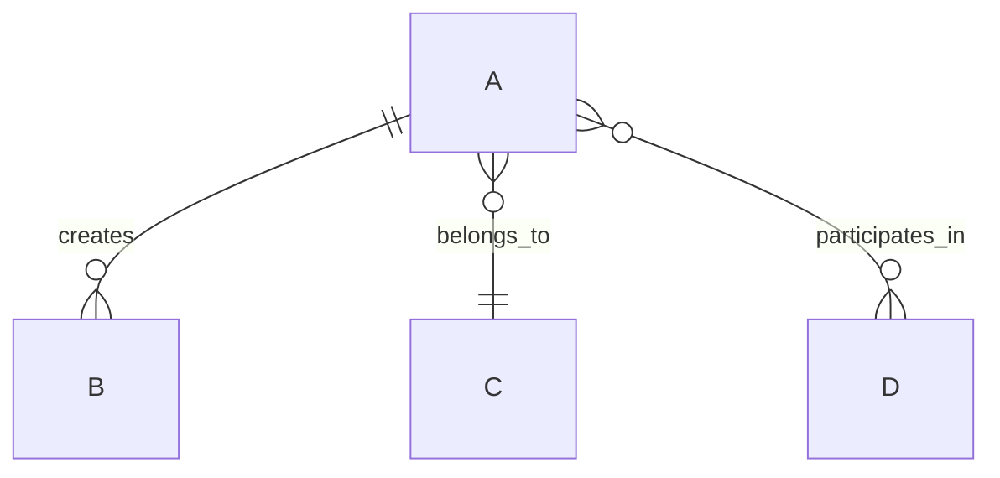

# ERD & Data Model Design Method

## Introduction
Entity-Relationship Diagram (ERD) framework and methodology for designing data models for multi-user platforms. Based on waste-management marketplace, community, and content platforms.

## When to Use This Method

- Designing a new product's data layer
- Multi-entity systems: users, content, transactions, social, admin
- Scope needs to support public/member/admin workflows
- Supporting future analytics and SaaS features

## Design Process

### Phase 1: Entity Inventory

List all core entities:
- **User Management**: users, profiles, roles, auth
- **Content**: posts, comments, threads, files
- **Marketplace**: listings, inquiries, services, requests
- **Social**: messages, ratings, badges, certifications
- **Community**: rooms, threads, moderation events
- **Analytics**: job logs, moderation events, audit trails

### Phase 2: Core Relationships

Map 1:1, 1:many, and many:many relationships:
- **One user → many posts** (1:many)
- **One post ↔ one category** (many:1)
- **One user ↔ many messages** (1:many)
- **User ↔ Room membership** (many:many via join table)
- **Vendor ↔ Services/Listings** (1:many)
- **Post ↔ Files** (1:many)

### Phase 3: Attribute Definition

Per entity, define:

**id** (Primary Key)
- Type: UUID or ULID (partition-friendly)
- Generation: Auto-generated at creation

**Foreign Keys**
- Reference parent entities
- Nullable if optional relationship
- Index for query performance

**Status Fields**
- Enum: `draft`, `pending_review`, `published`, `archived`, `rejected`
- Enables moderation workflows

**Timestamps**
- `created_at`, `updated_at` (always)
- `deleted_at` (soft deletes, optional)
- `published_at`, `approved_at` (event tracking)

**Metadata**
- `cover_url`, `avatar_url` (media)
- `slug` (URL-friendly unique identifier)
- `excerpt` (preview text)
- `location`, `category`, `tags` (filtering)

**Denormalization** (sparingly)
- `user.avatar_url`, `post.author_name` (read-heavy, update-rare)
- `listing.vendor_rating` (cached from vendor_profiles)
- Comment counts as materialized views

### Phase 4: Permission & Audit

Add columns for governance:

**Permission-Related**
- `user.role` (visitor, member, vendor, moderator, admin)
- `post.visibility` (public, members-only, private)
- `vendor_profile.verification_status` (unverified, pending, verified)

**Audit Trails**
- `moderation_events` table: moderator_id, action, entity_id, entity_type, notes, created_at
- `audit_logs` (optional): actor, action, resource, before/after snapshots

### Phase 5: Indexing Strategy

Plan indexes for common queries:
- **user.email, user.slug**: Lookup and profile URLs
- **post.user_id, post.category_id, post.status**: List user posts, filter by category, moderation queue
- **listing.user_id, listing.category_id, listing.location**: Marketplace search
- **message.sender_id, message.receiver_id, message.created_at**: Chat history
- **thread.room_id, thread.user_id**: Forum queries
- Composite: `(user_id, created_at)` for user's recent posts

### Phase 6: Scalability Considerations

For production platforms:
- **Partitioning**: By user_id or created_at for large tables (posts, messages)
- **Archival**: Move old posts to cold storage, retain recent in hot DB
- **Denormalization**: Cache counts (post_count, message_count) in user profile
- **Soft Deletes**: Mark deleted entities with `deleted_at` instead of hard delete
- **JSON Fields**: Store complex metadata (vendor service_area, post tags) as JSON/JSONB (PostgreSQL)

## Example ERD

```
users ||--o{ posts : creates
users ||--o{ listings : creates
users ||--o{ messages : sends
users ||--o| vendor_profiles : may_have
vendor_profiles ||--o{ services : offers
posts ||--o{ post_comments : has
listings ||--o{ inquiries : receives
messages: uuid id PK
messages: uuid sender_id FK
messages: uuid receiver_id FK
messages: text body
messages: datetime read_at
```

## Template: Entity Definition

For each entity:

**Entity Name: `users`**
- **Purpose**: Core identity, authentication, profile
- **Fields**:
  - id: UUID PK
  - email: string UNIQUE
  - password_hash: string
  - name: string
  - avatar_url: string
  - role: enum (visitor, member, vendor, moderator, admin)
  - bio, location, website: optional strings
  - status: enum (active, inactive, suspended)
  - created_at, updated_at: timestamps
- **Indexes**: email, role, created_at
- **Related**: posts, listings, messages, vendor_profiles, badges, certifications

## Mermaid Syntax Tips



- `||--o{` = 1:many (one A to many B)
- `}o--||` = many:1 (many A to one C)
- `}o--o{` = many:many (A and D through join table)

## Validation Checklist

- [ ] All entities have a primary key (id)
- [ ] All foreign keys are named consistently (entity_id)
- [ ] Status fields use enums, not free text
- [ ] Timestamps (created_at, updated_at) on all entities
- [ ] Public-facing entities have slug or unique identifier
- [ ] User permission model is explicit (role or visibility)
- [ ] Moderation events are tracked
- [ ] Join tables for many:many are explicit
- [ ] No circular dependencies
- [ ] Indexes planned for common queries

## Tools

- **Mermaid**: Quick visual ERD (web, GitHub markdown)
- **dbdiagram.io**: Interactive design with SQL export
- **PostgreSQL pg_dump**: Reverse-engineer existing schemas
- **Prisma Schema**: TypeScript-friendly ORM schema

---

*Open source — use it wisely.*
